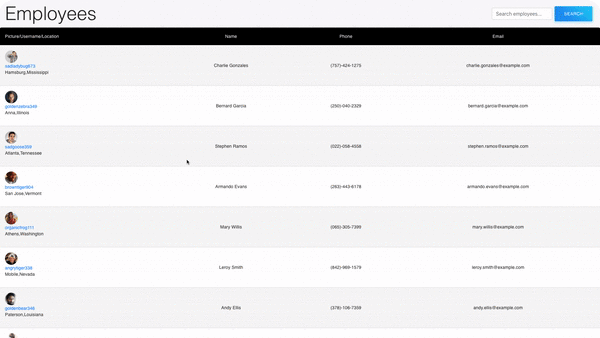

# Employee Directory

## Description

Employee Directory is an application that gives the user the ability to view a table rendered with their employees and their contact information.

## Table of Contents

  - [Description](#description)
  - [Introduction](#introduction)
  - [Demo](#demo)
  - [Technologies](#technologies)
  - [Contributing](#contributing)
  - [License](#license)
  - [GitHub Repo,Profile, Quesitons](#github-repoprofile-questions)

## Introduction

Have you ever needed to find contact information for your coworker/employee? By the way their name is John Smith....but is it John Smith, this John Smith, John A. Smith, John Smith Jr? Don't worry the Employee Directory application is here to help sort this out. The Employee Directory contains vital information to help get you the contact information you need to get a hold of your Smith quick.  With the Employee Directory you will get a table rendered with profile picture, their name, user name, location, phone number, and email; you also have the ability to search by name and sort name. This will definitely make your life easier and hopefully save you from sending a message to someone that doesn't need to know that your IBS is flaring up real bad, not to go into the bathroom down the hall because you just destroyed it, and you're needing to go home for the day and get new underwear. Save yourself the embarrassment and use the Employee Directory.

### Demo

[View Employee Directory](https://damp-fjord-75220.herokuapp.com/) Live on Heroku

## Technologies
  - React
  - Bootstrap
  - Material-UI
  - Random User API
  - Heroku

## Contributing
1. Fork it!
2. Create your branch: `git checkout -b your-branch-name-here`
3. Add and commit your changes
4. Push to your branch
5. Submit a pull request

## License

## GitHub Repo,Profile, Questions

* [Repository](https://github.com/brandt-fricker/super-duper-chainsaw)
* [GitHub Profile](https://github.com/brandt-fricker)
* Any questions, comments, or concerns please feel free to contact me, all my info can be found [here](https://drive.google.com/file/d/1lZC64xhP2PnV-DXlreSIA11vyq-aKmZ2/view?usp=sharing)
